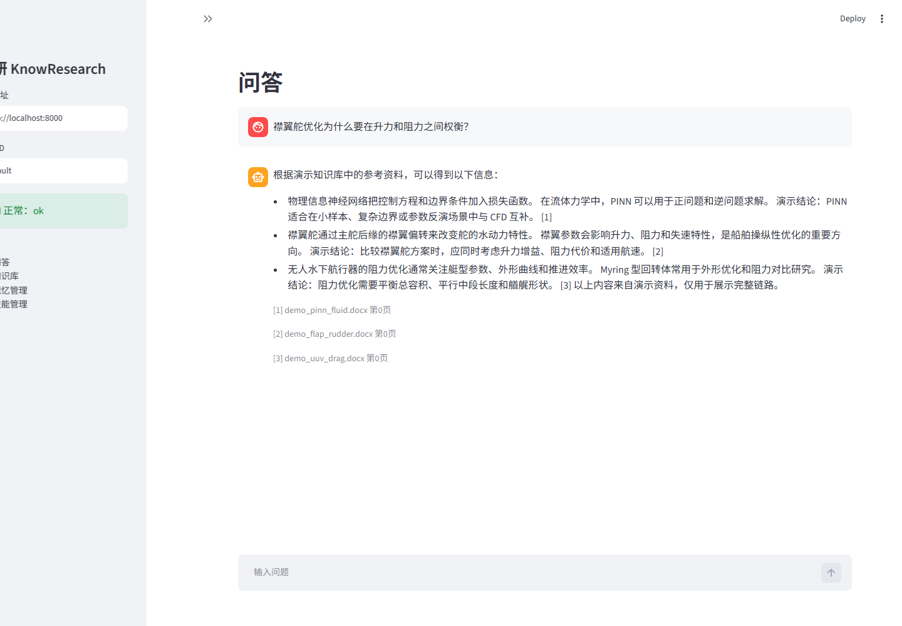
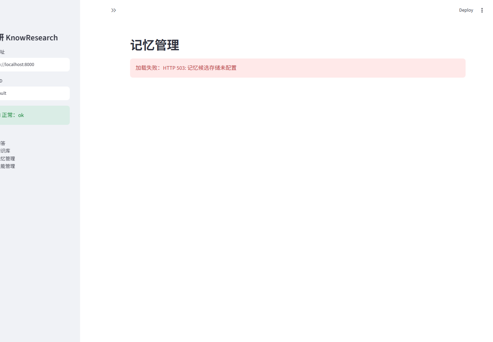
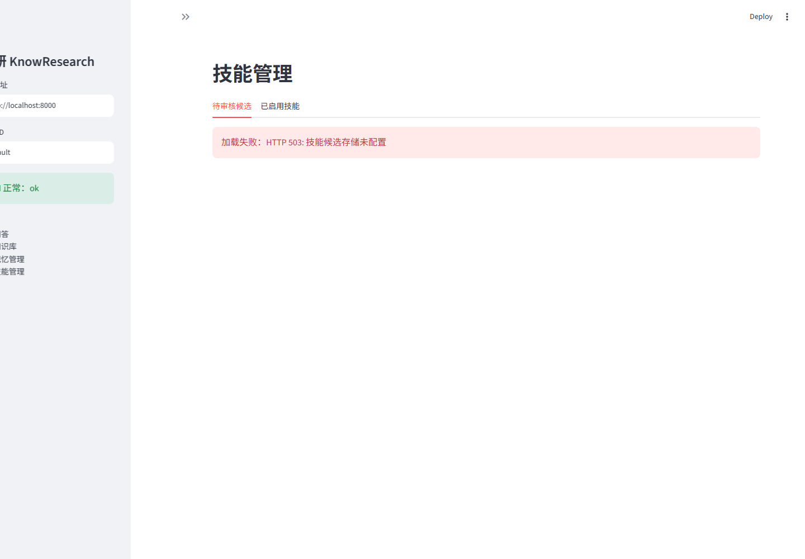
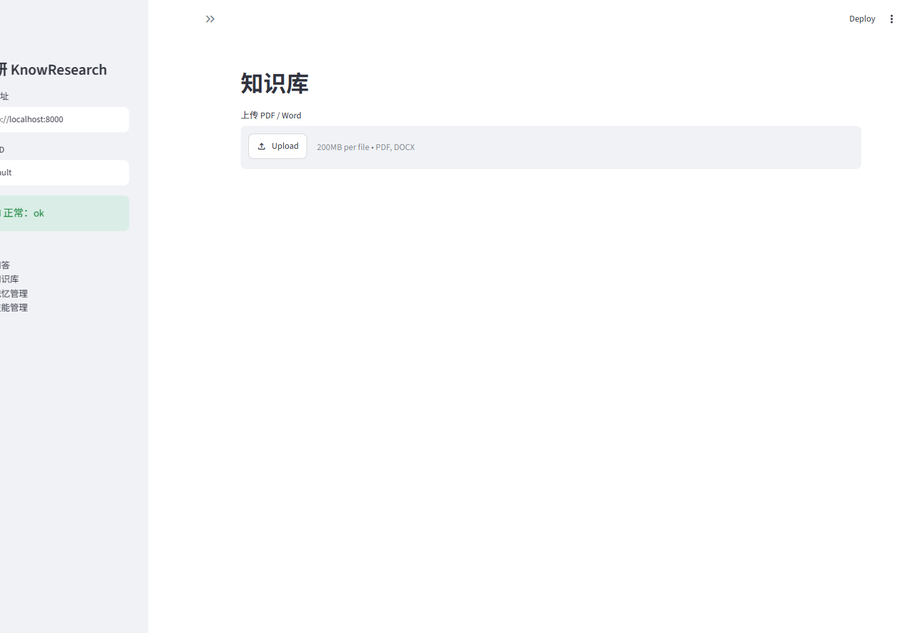
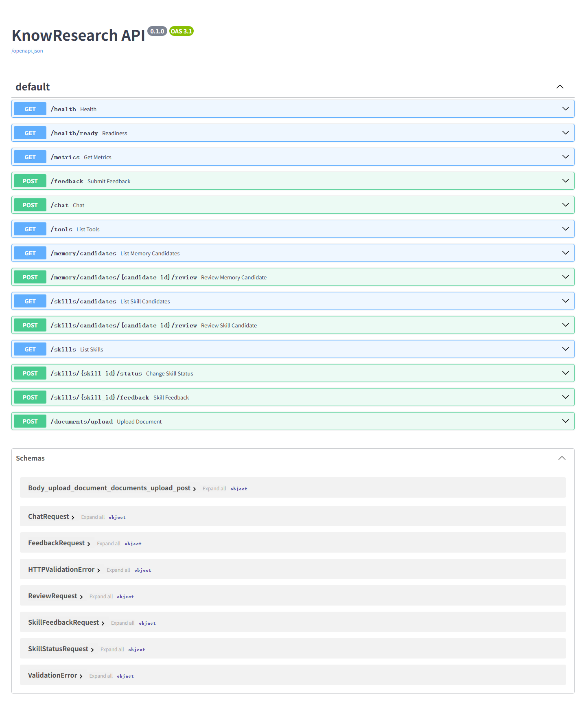
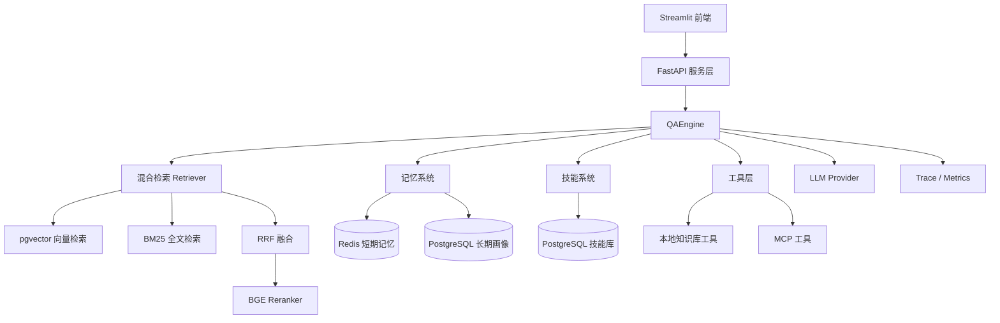

# 知研 KnowResearch

面向研究生 / 学者的科研知识库 Agent：多源文档解析、混合检索、引用溯源、三层记忆、技能沉淀、工具层和 MCP 扩展。


## 项目亮点

- **RAG 主链路**：PDF / Word 解析 → 切块 → 向量 + BM25 → RRF 融合 → rerank → 带引用生成
- **三层记忆**：Redis 短期记忆、PostgreSQL 长期画像、候选画像审核
- **技能沉淀**：从 traces 抽取候选技能、回放验证、审核、注入、反馈和版本回滚
- **可插拔工具层**：本地知识库工具 + MCP stdio / streamable HTTP 工具
- **可观测性**：trace_id、阶段耗时、token、运行指标、健康检查
- **可演示前端**：Streamlit 问答、上传、记忆管理、技能管理

## 界面截图

### 问答与引用



### 记忆管理



### 技能管理



### 知识库上传



### API 文档



## 架构



## 快速开始

### 1. 启动 Demo

```powershell
python scripts/demo_up.py
```

该命令会：

1. 启动 PostgreSQL + Redis
2. 初始化演示文档、画像和技能
3. 启动 FastAPI
4. 启动 Streamlit

访问：

```text
http://localhost:8501
http://localhost:8000/docs
```

检查状态：

```powershell
python scripts/demo_status.py
```

停止：

```powershell
python scripts/demo_down.py
```

### 2. Demo 模式说明

演示模式：

```text
DEMO_MODE=1
```

特点：

- 使用 Mock Embedding / Reranker
- 使用本地 Demo LLM
- 不依赖 GPU
- 不依赖 DeepSeek API Key
- 使用独立 `chunk_vectors_demo` 表

正式模式：

```text
DEMO_MODE=false
```

正式模式使用本地 BGE 和 DeepSeek API。

## 核心流程

```text
文档上传
  → 解析 / 切块 / hash 去重
  → PostgreSQL 文档存储
  → pgvector 向量索引
  → BM25 全文索引
  → 混合检索 + RRF + rerank
  → 带引用生成
  → trace / metrics
  → 记忆候选 / 技能候选
  → 人工审核
```

## 技术栈

| 层 | 技术 |
|---|---|
| 语言 | Python 3.11 |
| 核心模型 | BGE Embedding / BGE Reranker |
| 生成模型 | DeepSeek API |
| 数据库 | PostgreSQL + pgvector |
| 缓存 / 短期记忆 | Redis |
| API | FastAPI |
| 前端 | Streamlit |
| 工具协议 | MCP |
| 测试 | pytest |

## 目录结构

```text
knowresearch/
├── frontend/                 # Streamlit 前端
├── scripts/                  # 演示、入库、评估脚本
├── src/knowresearch/
│   ├── api/                  # FastAPI
│   ├── core/
│   │   ├── ports/            # 端口接口
│   │   ├── schemas/          # 数据 schema
│   │   ├── retrieval/        # 检索 / RRF / rerank
│   │   └── generation/       # prompt / 答案生成
│   ├── adapters/             # SQLite / PostgreSQL / Redis / MCP / 模型适配器
│   ├── ingestion/            # 解析 / 切块 / 入库
│   ├── memory/               # 画像抽取 / 审核 / 注入
│   ├── skills/               # 技能抽取 / 回放 / 生命周期
│   ├── tools/                # 工具层 / MCP
│   └── evaluation/           # 评估集 / 指标 / 实验
├── data/eval/                # 评估集
├── docs/                     # 文档和截图
└── tests/                    # 测试
```

## 测试

```powershell
python -m pytest tests -q
```

当前状态：

```text
204 passed
```

## 评估

运行评估集：

```powershell
python scripts/run_eval.py --limit 10
```

指标包括：

- Hit Rate
- Recall@K
- MRR
- nDCG@10
- 引用准确率
- 引用覆盖率
- 无答案准确率
- 失败率
- P95 延迟

## 已知限制

- 演示模式使用 Mock Embedding / Reranker，重点展示链路，不代表最终检索质量
- 真实模型对比实验尚未运行
- 生产部署所需的认证、权限和备份恢复仍需补充
- License：MIT

## 后续规划

- 运行完整 62 篇论文的真实评估
- 完成 embedding / reranker 对比实验
- 增加真实演示视频
- 完善错误分类和告警
- 补充生产部署文档
